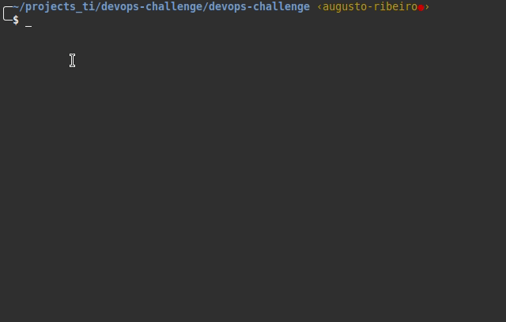
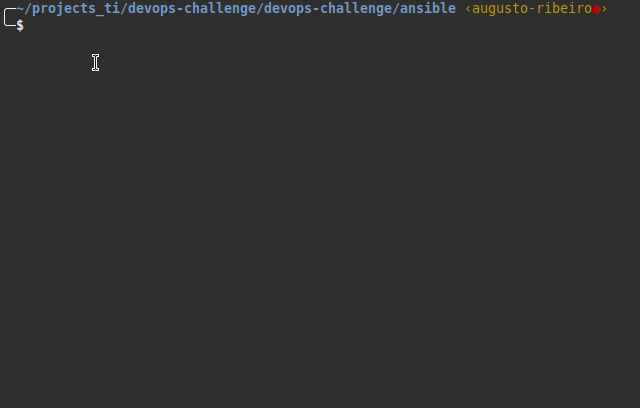
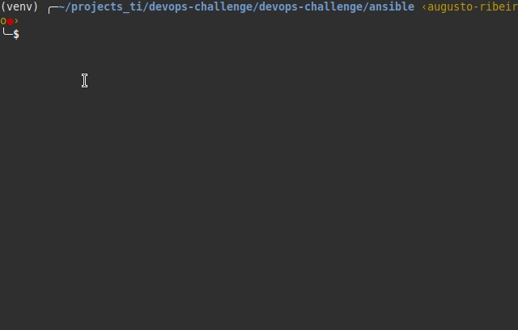

# Ansible

Foi utilizado o ansible para automatizar a instalação de pacotes e configurações.

## 1. Instalação do Ansible

A instalação do Ansible e demais dependências será por meio do uso de um virtualenv do python.

**Passo a passo:**

1. Em um terminal, estando no diretório raiz desse projeto, acesse o diretório ***ansible***:
    ```shell
    cd ansible
    ```
    

2.  Crie um virtualenv chamado ***venv*** com o comando abaixo:
   ```shell
    virtualenv venv
   ```
3. Ative o virtualenv com o comando:
   ```shell
    source venv/bin/activate
   ```
   

4. Instale o ansible no virtualenv e demais depenências necessárias com o comando:
   ```shell
    pip install -r requirements.txt
   ``` 
   

***Esclarecendo***: O comando acima instala o ansible e demais dependências necessárias ao perfeito funcionamento do módulo **[ec2.py](../ansible/ec2.py)**. Esse módulo, permite trabalharmos com um inventário dinânico de VMs que estão na AWS. Essa instalação é apenas no virtualenv.

### 1.1. Validando o funcionamento do inventário

**Passo a passo:**

Os comandos devem ser executados dentro do diretório ansible deste repositório.

1. Exporte variável de ambiente da AWS_ACCESS_KEY_ID, com o comando:
   ```shell
    export AWS_ACCESS_KEY_ID='SUA_ACCESS_KEY_ID'
   ```
2. Exporte a variável de ambiente da AWS_SECRET_ACCESS_KEY, com o comando:
   ```shell
    export AWS_SECRET_ACCESS_KEY='SUA_SECRET_KEY'
   ```
3. Valide se está funcionando o inventário dinâmico com o comando:
   ```shell
     python3 ec2.py --list
   ```
Deve ser retornando uma série de informações, incluindo as tags e ips, por exemplo, das VMs que estão instanciadas na AWS.

**Obs.:** Deve-se configurar antes dos passos acima, uma Access Key e Secret Key na console da AWS, com as devidas permissões, através do IAM.