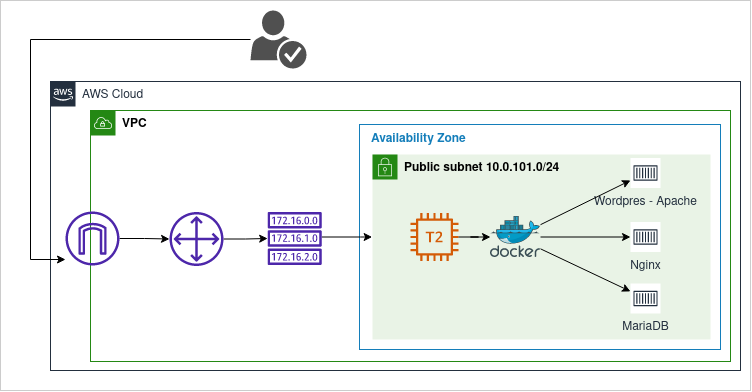

## Diagrama

# Infra estrutura com Terraform na AWS

+ O código cria a infraestrutura na AWS e gera a chave SSH na máquina local
 

## Para utilizar o código

- Verifique o arquivo ___variables.tf___ na raiz do projeto e altere, se for necessário, as variáveis ___namespace___ e ___region___

Execute no seu terminal:

- export AWS_SECRET_ACCESS_KEY="" 
- export AWS_ACCESS_KEY_ID=""

Em seguida, ainda no terminal:

- terraform init
- terraform plan
- terraform apply

## Para acessar a máquina EC2

#### Saída do log do Terraform

key_name = "Chave SSH  teste-apiwiki-key.pem "
public_ip = "Conect ssh -i teste-apiwiki-key.pem ubuntu@34.201.139.77 "
web = "Aguarde alguns minutos e acesse http://34.201.139.77 "

## Melhorias

- Melhorar as variáveis de automação em Ansible
- Gerar um certificado válido via Letsencrypt ou utilizar um serviço de WAF para melhorar a segurança ( a segunda opção seria ótima)
- Criar uma configuração personalizada para o Apache (iria melhorar a necessidade de módulos adicionais e dar mais flexibilidade na implantação de nvoos rercusos)
- Identificar possibilidade de gerar uma imagem Docker personalizada para escalabilidade do serviço
- Balanceador de carga para as instâncias, caso o serviço seja escalado.
- Criar automação no Terraform para adicionar um RDS (MySQL/Aurora)
- Revisitar os processos do Ansible para identificar melhorias de segurança antes da implantação